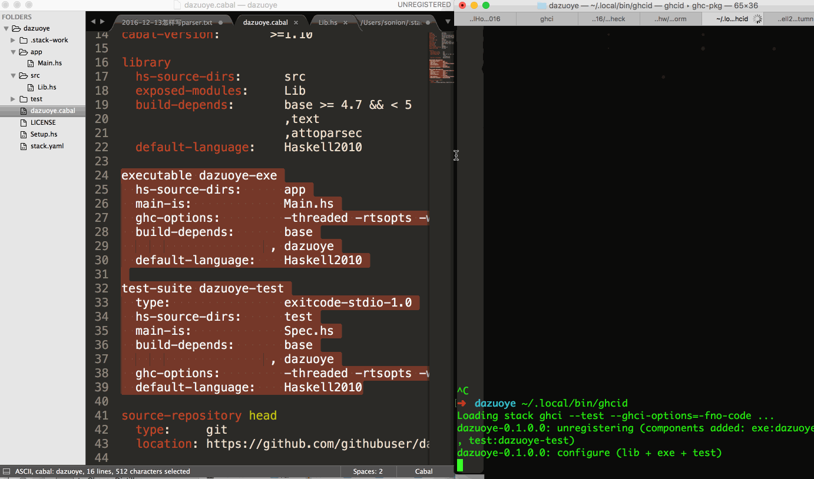

讲课的：[Canto Ostinato](https://github.com/terrorjack)

记笔记的：SnowOnion

Licence：暂时 all rights reserved。取决于 Canto Ostinato 的授权。

# 话题1：怎样实现一个 Parser

## 建立项目

1. 初始化stack项目（并使用用最新的snapshot……）

		$ stack new dazuoye --resolver nightly-2016-12-12

	记号约定：用 `$ x -y z` 表示用命令行执行 `x -y z`。用 `ww $ x -y z` 表示在 `ww` 这个工作目录下执行 `x -y z`。
		
	关于 stack 和 snapshot 的介绍：[Hackage,Stackage,stack.md](Hackage,Stackage,stack.md)

2. 修改 `dazuoye/dazuoye.cabal` 

+ 删除 executable dazuoye-exe 和 test-suite dazuoye-test 这两块儿配置（可能是24到39行）。我们先只关心library。

+ 在`dazuoye/dazuoye.cabal`的library的build-depends 里添加两个依赖

		,text
		,attoparsec
添加之后的样子：

		library
		  hs-source-dirs:      src
		  exposed-modules:     Lib
		  build-depends:       base >= 4.7 && < 5
		                       ,text
		                       ,attoparsec
		  default-language:    Haskell2010

此时执行

	$ stack ghci

会需要较长时间去下载和构建这两个依赖。

## 可选的工具：ghcid

ghcid承担一些IDE的职责 。

是基于ghci的。

### 用上之后的效果

在屏幕的一边儿编辑 Lib.hs，另一边儿开着 ghcid。

每次一保存文件，ghcid就即时检查错误，报错或显示 all good。……这很敏捷

### 安装和运行

	$ cd dazuoye
	dazuoye $ stack install ghcid
	dazuoye $ ghcid

p.s. 在 macOS 上，ghcid 可执行文件会被放到 `~/.local/bin`

所以需要把 `~/.local/bin` 加入环境变量 PATH，或直接调用 `~/.local/bin/ghcid ` 而非 `ghcid`.

其他系统没试。

## text 库

[https://hackage.haskell.org/package/text-1.2.2.1](https://hackage.haskell.org/package/text-1.2.2.1)

Data.Text 是一种更好的字符串类型。

在 ghci 里试一下：
	
	dazuoye $ stack ghci
	blah blah
	Ok, modules loaded: Lib.
	blah blah
	
	*Lib Lib> import Data.Text
	*Lib Lib Data.Text> :{
	*Lib Lib Data.Text| t :: Text
	*Lib Lib Data.Text| t = "123"
	*Lib Lib Data.Text| :}
	
	<interactive>:4:5: error:
	    • Couldn't match expected type ‘Text’ with actual type ‘[Char]’
	    • In the expression: "123"
	      In an equation for ‘t’: t = "123"
	*Lib Lib Data.Text> :set -XOverloadedStrings
	*Lib Lib Data.Text> :{
	*Lib Lib Data.Text| t :: Text
	*Lib Lib Data.Text| t = "123"
	*Lib Lib Data.Text| :}
	*Lib Lib Data.Text> t
	"123"
	*Lib Lib Data.Text> :t t
	t :: Text
	
请注意 `:set -XOverloadedStrings` 。这[让字符串字面量可以直接绑定到 Text 类型的变量上](http://stackoverflow.com/questions/6363834/why-dont-the-data-text-examples-work-for-me)。

在 .hs 文件中，要做相同的配置，需要在文件第一行加 `{-# LANGUAGE OverloadedStrings #-}`。见 [dazuoye/src/Lib.hs]()。

## attoparsec 库

### 太长不看（或者上课已经听过了）

这里是[上课讲的完整示例](dazuoye)。

#### 用法

	$ cd dazuoye
	dazuoye $ stack ghci

### 即使很长也想看

下面大致记录了课上的讲解过程。

# --- 2016-12-13 21:57:24 施工分割线 以下内容未详细整理 格式也乱七八糟 还可能有错---

各种parser大致都是
Input -> Maybe (Result,Input)
Input -> [(Result,Input)] -- 兹瓷歧义文法

而 attoparsec 只支持前一种

import Data.String
import Data.Text
import Data.Attoparsec.Text
:set -XOverloadedStrings

left = char '('

parseOnly left "(123"

trueParser = do
	char 'T'
	char 'r'
	char 'u'
	char 'e'
	
parseOnly trueParser "Tr123"

### 不一个一个字符parse 而是parse字符串

trueParser2 = string "True"

	*Main Lib Data.Text Data.Attoparsec.Text Data.String> parseOnly trueParser2 "Trueorfalse123"
	Right "True"
	*Main Lib Data.Text Data.Attoparsec.Text Data.String> parseOnly trueParser2 "trueorfalse123"
	Left "string"

### 如果要忽略大小写

trueParser3 = asciiCI "True"

现在我们会parse出一个字符串了。

# 定义一些语法结构，以布尔表达式为例

module Lib where

data Expr
	= TrueLit
	| FalseLit
	| Not Expr
	| And Expr Expr
	| Or Expr Expr
	deriring Show
	
	
-- 先定一个顶层目标
exprParser :: Parser Expr
exprParser = undefined 

### 如果只管 "True" 和 "False"

falseParser :: Parser Text
falseParser = string "False"

trueParser :: Parser Text
trueParser = string "True"

### 下面, not 表达式

	notParser :: Parser Expr
	notParser = do
		char '('
		skipspace
		string "not"
		skipspace
		expr <- exprParser -- 绑定到 expr 这个名字
		skipspace
		char ')'
		return (Not expr) -- 使用 Not 这个 data constructor，构造出有利于我们后续处理的（树形）结构
		
这需要改造成

	falseParser :: Parser Expr
	falseParser = string "False" $> FalseLit
	
	-- $> 是啥？
	
	trueParser :: Parser Expr
	trueParser = string "True" $> TrueLit

Applicative 类型类的实例都有的 alternative 操作符 <|>

	p0 <|> p1
含义：先p0解析，如果失败，则用p1解析

所以：

	exprParser :: Parser Expr
	exprParser = falseParser <|> trueParser <|> notParser

### and 和 or 的 parser 

留给读者

### 烦恼：每次手动 skipspace
一般，编译时先lexing，排除注释、空白，把字符串变成token串。而我们的parser省了lexing这一步……

一个解决办法：写一个lexeme。“抽象出去掉空格这个设计模式”。

	lexeme :: Parser a -> Parser a
	lexeme p = do
		skipSpace
		p

	notParser :: Parser Expr
	notParser = do
		lexeme $ char '('
		lexeme $ string "not"
		expr <- exprParser
		lexeme $ char ')'
		return (Not expr) 

---

# 话题2：怎样实现一个 REPL (ghci, python 那样的交互式环境，
---

https://hackage.haskell.org/package/text-1.2.2.1/docs/Data-Text-IO.html

	import Data.Text.IO
	
	interact :: (Text -> Text) -> IO () Source
	
	The interact function takes a function of type Text -> Text as its argument. The entire input from the standard input device is passed to this function as its argument, and the resulting string is output on the standard output device.
	
以一个 Text -> Text 函数作为输入，即可得到一个交互器……	
Data.Text.IO.interact :: (Text -> Text) -> IO () Source
以一个 Text -> Text 函数作为输入，即可得到一个交互器……

f 
	
	
## 问题：这样暂时没法保存状态
暂时没法实现

	> a=1
	1
	> a
	1
	> b
	undefined
这种。

下节课说 可保存状态的 REPL。